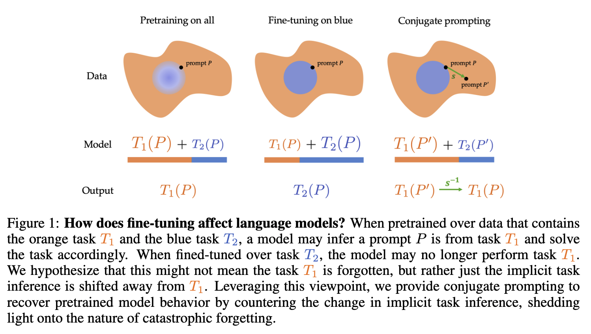

# Understanding Catastrophic Forgetting in Language Models via Implicit Inference

<div style="text-align: center;">
    
</div>

<br>

Repository for the language model experiments in [Understanding Catastrophic Forgetting in Language Models via Implicit Inference](https://arxiv.org/abs/2309.10105)

## Overview

It is well known that fine-tuning can induce catastrophic forgetting, or unnecessary lowered performance for some pretraining tasks. But is the model actually "forgetting" how to perform the pretraining task? We provide a candidate explanation for this phenomenon: what looks like forgetting is actually the model almost always utilizing the capability featured during fine-tuning instead of the other capabilities learnt during pretraining. Importantly, the model may still be capable of performing the pretraining task, even though it incorrectly infers that every prompt is best solved with the fine-tuning capability.

How can we test such a hypothesis? In this paper, we consider *Conjugate Prompting*, or applying a transformation on the prompt that preserves the core task while lowering the likelihood under the fine-tuning distribution. This helps the model infer what task to perform while preserving the problem solved at inference time.

In this paper, we operationalize this test on synthetic experiments on linear regression and realistic evaluations on real language models. Since language models are generally fine-tuned only on English, we utilize *language translation* as the tranformation for conjugate prompting; we simply translate the prompt to a different language before feeding it into the model. We test our intuition in three different natural language settings

- Recovering in-context learning ability lost during instruction tuning
- Recovering harmful content generation lost during safety fine-tuning
- Recovering natural language reasoning lost during code fine-tuning

Across the board, we find that forgetting is lower in non-English languages, supporting the claim that capabilities may be preserved during fine-tuning and "forgetting" might not be as catastrophic as expected.

We hope this codebase provides a clean reproduction of our results, and don't hesitate to reach out with any questions or concerns!

## Replication

Install the provided conda environment
```
conda env create -f environment.yml
```

`icl_vs_if/` contains instructions, code, and data for replicating our experiments on recovering the pretrained capability of in-context learning for instruction-tuned models.

`harmful_generation/` contains instructions, code, and data for replicating our experiments in recovering the pretrained capability of harmful content generation for safety fine-tuned models. (Update: These experiments are deprecated due to OpenAI discontinuing the models used in these experiments)

`code_xnli/` contains instructions, code, and data for replicating our experiments on recovering the pretrained capability of natural language reasoning for code fine-tuned models.

## Citation

If you found this paper or repository helpful, consider citing us!

```
@misc{kotha2023understanding,
      title={Understanding Catastrophic Forgetting in Language Models via Implicit Inference}, 
      author={Suhas Kotha and Jacob Mitchell Springer and Aditi Raghunathan},
      year={2023},
      eprint={2309.10105},
      archivePrefix={arXiv},
      primaryClass={cs.CL}
}
```

